# Programming Social Network Front End

A social networking platform designed for programmers to ask questions, share knowledge, and discuss programming topics. This project aims to create a community-driven space that fosters learning and collaboration among developers.

## 1. Team Members

| No. | Student ID | Full Name                  |
|-----|------------|----------------------------|
| 1   | 22520190   | **Nguyễn Lưu Minh Đăng (Leader)**       |
| 2   | 22520090   | Mai Thanh Bách             |

## 2. Purpose and Motivation

- **Build a collaborative platform:** Enable programmers to exchange ideas, ask questions, and share code snippets in a community setting.
- **Enhance knowledge sharing:** Provide a reliable resource for both beginners and experienced developers to learn and solve problems.
- **Improve community engagement:** Encourage active participation through features like voting, commenting, and reputation tracking.

## 3. Key Features

- **User Authentication:** Registration, login, and password recovery.
- **Question & Answer System:** Post, edit, and delete questions and answers.
- **Commenting:** Add, edit, and delete comments on posts.
- **Tag Management:** Organize content with tags to facilitate topic-based searches.
- **Voting Mechanism:** Upvote or downvote questions and answers to highlight useful content.
- **User Profiles:** Manage personal information and view activity history.
- **Search Functionality:** Search questions, answers, and users by keywords and tags.
- **Moderation Tools:** Admin functionalities for content review and user management.

## 4. Technologies Used

- **Backend:** ASP.NET Core WebAPI
- **Frontend:** React.js
- **Database:** SQL Server
- **Additional Tools:** GitHub for version control, Visual Studio/VS Code for development

## 5. System Architecture
|  |
| :---------------------------: |
| _Overall Architecture_ |

- **Frontend**: Responsive UI built with ReactJS.
- **Backend**: Modular ASP.NET Core API handling business logic.
- **Database**: SQL Server for relational data storage.

## 6. User Guide

### **User:**

  
Login Page

| 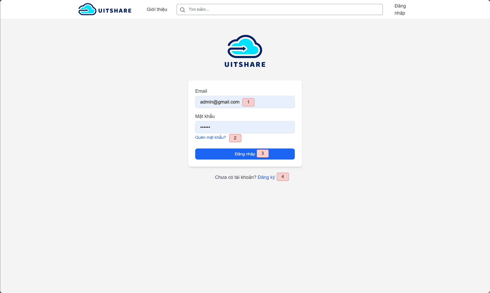 |
| :---------------------------: |
| _Login Screen_ |

1. Enter Login Information.
2. Forgot Password.
3. Login.
4. Sign Up.

  
Sign Up Page

| 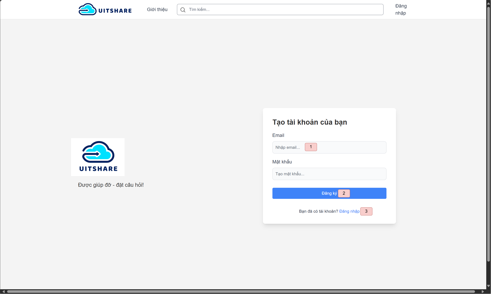 |
| :----------------------------: |
| _Sign Up Screen_ |

1. Enter Sign Up Information.
2. Sign Up.
3. Back to Login.

  
Home Page

| 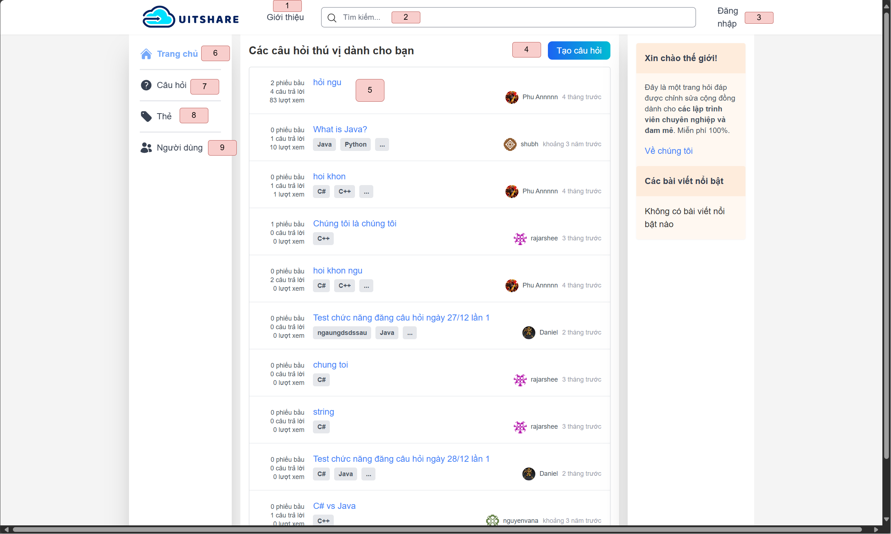 |
| :------------------------------: |
| _Home Screen_ |

1. About Us.
2. Search question.
3. Login.
4. Add New Question.
5. Questions.
6. Home Page.
7. Questions Page.
8. Tags Page.
9. Users Page.

  
Questions Page

| 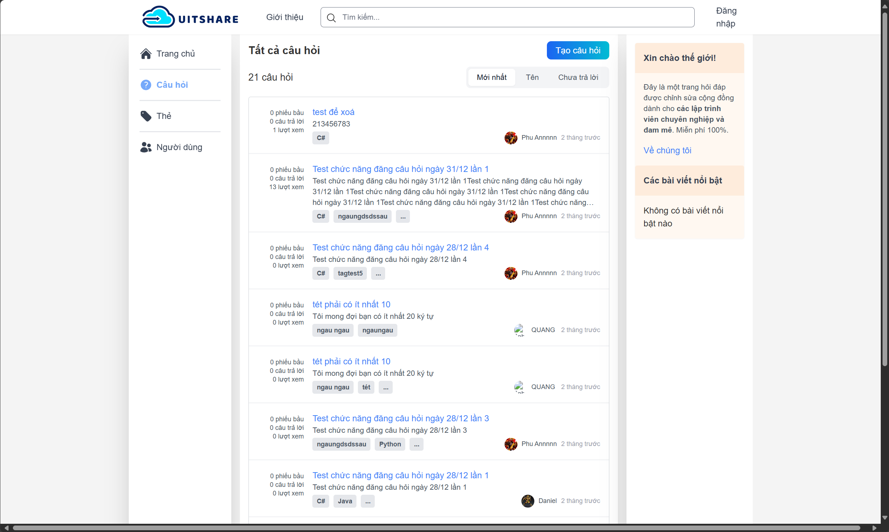 |
| :---------------------------------------: |
| _All Questions Screen_ |

  
Question Search Page

| 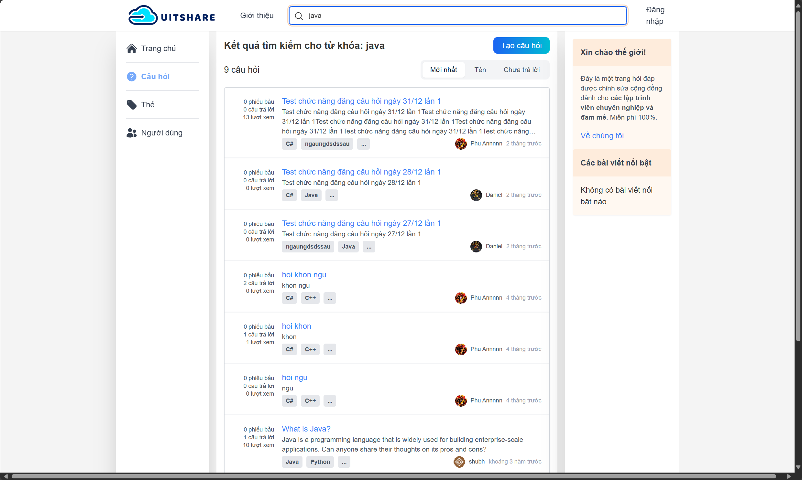 |
| :------------------------------------------: |
| _Question Search Screen_ |

  
Question With Tag Page

| 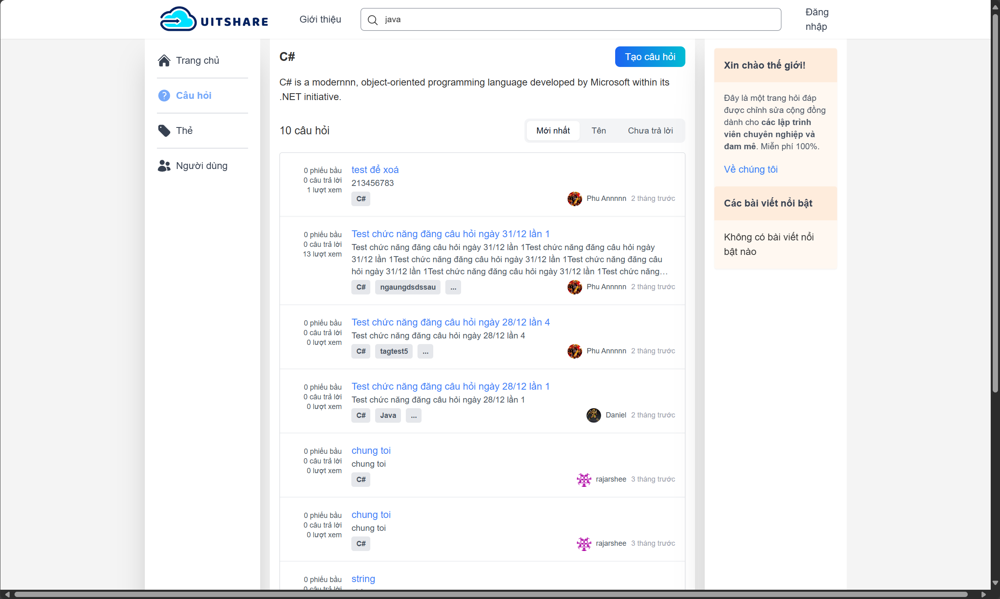 |
| :-------------------------------------------: |
| _Question With Tag Screen_ |

  
Add New Question Page

| 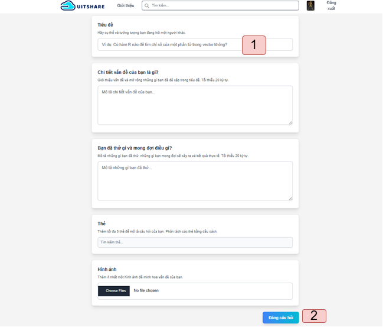 |
| :------------------------------------------: |
| _Add New Question Screen_ |

1. Enter Question Information.
2. Add New Question.

  
Question Detail Page

| 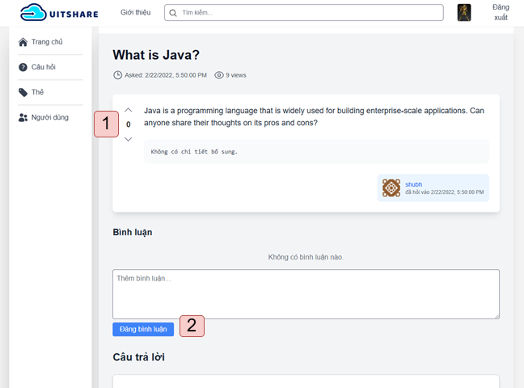 |
| :------------------------------------------: |
| _Question Detail Screen_ |

1. Upvote/Downvote Question.
2. Comment Question.

  
Tags Page

| 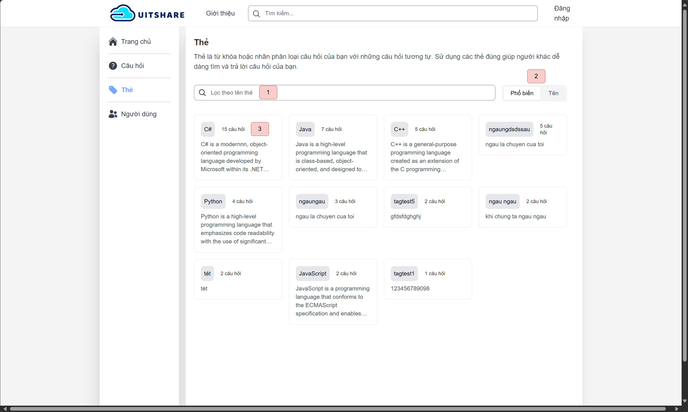 |
| :----------------------------------: |
| _All Tags Screen_ |

1. Search Tag name.
2. Sort Tags.
3. Tag List.

  
All Users

| 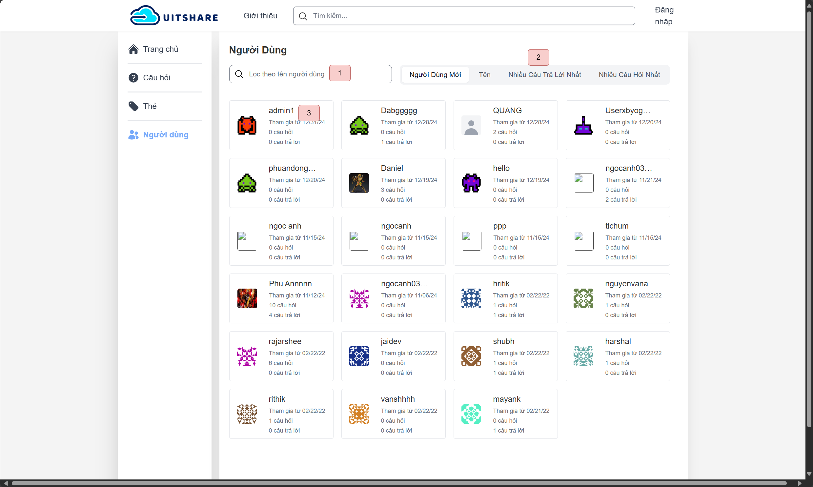 |
| :------------------------------------: |
| _All Users Screen_ |

1. Search User.
2. Sort Users.
3. User List.

  
User Profile

| 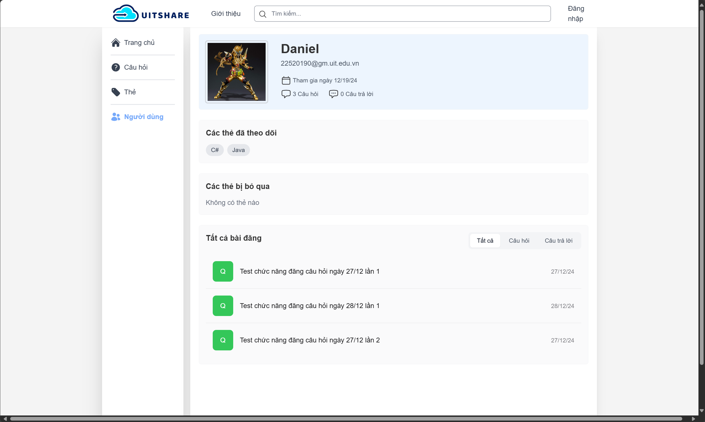 |
| :----------------------------------: |
| _User Profile Screen_ |

  
About Us

| 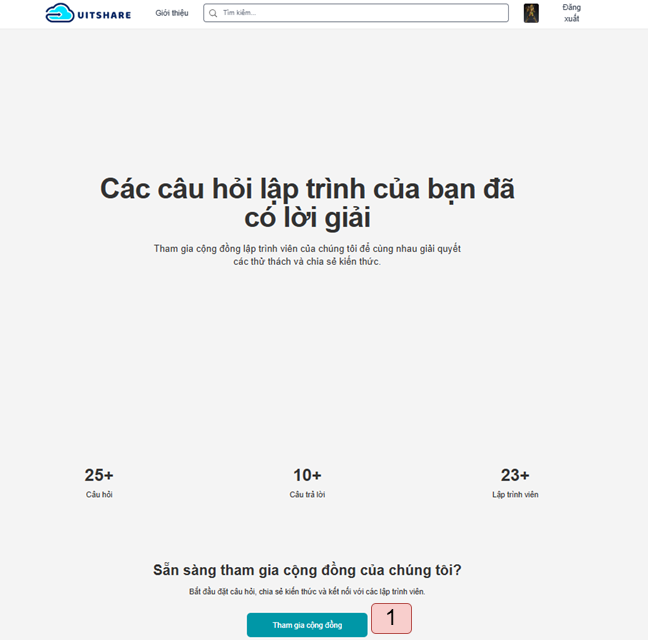 |
| :----------------------------------: |
| _About Us Screen_ |

### **Admin:**

  
Admin Dashboard Page

| 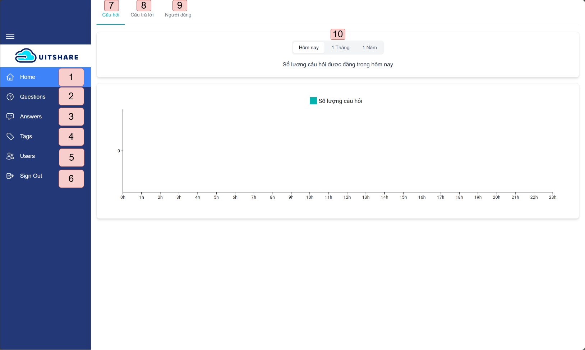 |
| :-------------------------------------: |
| _Admin Dashboard Screen_ |

1. Dashboard Page.
2. Questions Page.
3. Answers Page.
4. Tags Page.
5. Users Page.
6. Sign Out.
7. Questions Tab.
8. Answers Tab.
9. Users Tab.
10. Active Report.

  
Admin Questions Page

| 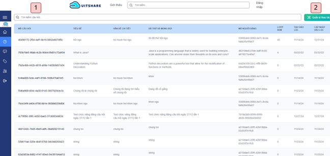 |
| :----------------------------------------: |
| _Admin Question List Screen_ |

1. Search Question.
2. Manage Actions (Edit/Delete).

  
Admin Answers Page

| 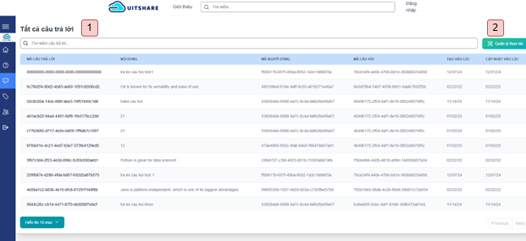 |
| :--------------------------------------: |
| _Admin Answer All Screen_ |

1. Search Answers.
2. Manage Actions (Edit/Delete).

  
Admin Tags Page

| 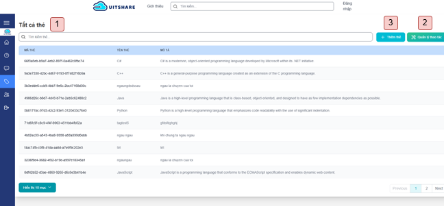 |
| :-----------------------------------: |
| _Admin Tag List Screen_ |

1. Search Tag.
2. Manage Actions (Edit/Delete).
3. Add New Tag.

  
Admin Users Page

| 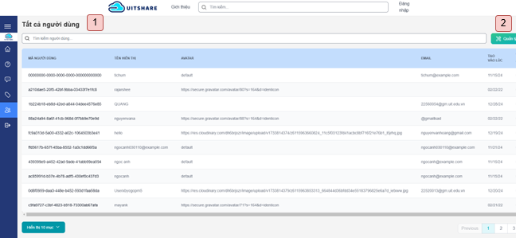 |
| :-------------------------------------: |
| _Admin User List Screen_ |

1. Search User.
2. Manage Actions (Edit/Delete).

