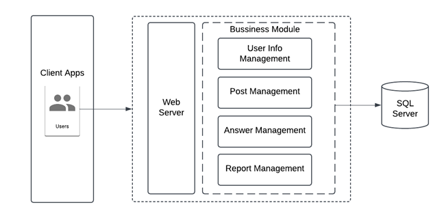

# Programming Social Network

A social networking platform designed for programmers to ask questions, share knowledge, and discuss programming topics. This project aims to create a community-driven space that fosters learning and collaboration among developers.

## 1. Team Members

| No. | Student ID | Full Name                  |
|-----|------------|----------------------------|
| 1   | 22520190   | Nguyễn Lưu Minh Đăng       |
| 2   | 22520058   | Nguyễn Nguyên Ngọc Anh     |
| 3   | 22520090   | Mai Thanh Bách             |

## 2. Purpose and Motivation

- **Build a collaborative platform:** Enable programmers to exchange ideas, ask questions, and share code snippets in a community setting.
- **Enhance knowledge sharing:** Provide a reliable resource for both beginners and experienced developers to learn and solve problems.
- **Improve community engagement:** Encourage active participation through features like voting, commenting, and reputation tracking.

## 3. Key Features

- **User Authentication:** Registration, login, and password recovery.
- **Question & Answer System:** Post, edit, and delete questions and answers.
- **Commenting:** Add, edit, and delete comments on posts.
- **Tag Management:** Organize content with tags to facilitate topic-based searches.
- **Voting Mechanism:** Upvote or downvote questions and answers to highlight useful content.
- **User Profiles:** Manage personal information and view activity history.
- **Search Functionality:** Search questions, answers, and users by keywords and tags.
- **Moderation Tools:** Admin functionalities for content review and user management.

## 4. Technologies Used

- **Backend:** ASP.NET Core WebAPI
- **Frontend:** React.js
- **Database:** SQL Server
- **Additional Tools:** GitHub for version control, Visual Studio/VS Code for development

## 5. System Architecture
|  |
| :---------------------------: |
| _Overall Architecture_ |

- **Frontend**: Responsive UI built with ReactJS.
- **Backend**: Modular ASP.NET Core API handling business logic.
- **Database**: SQL Server for relational data storage.
